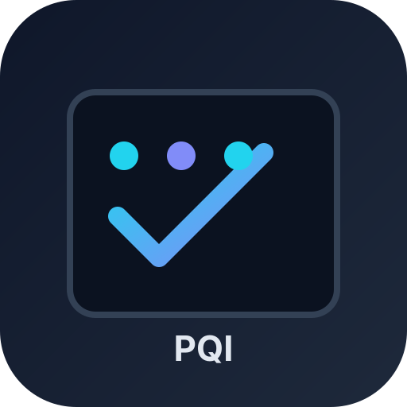

# PR Quality Intel

[](https://github.com/Operative-001/pr-quality-intel/actions/workflows/test.yml)
[](LICENSE)

<p align="center">
  
</p>

> PR-level quality intelligence: drift detection, staleness alerts, merge readiness scoring.

## New in Round 2

- **Pre-submit drift warning** (`pqi precheck`) with threshold and actionable output
- **Self-healing auto-pings** (`pqi ping`) for PRs nearing stale threshold, includes PR links
- **AI summary digest** (`pqi summary`) grouped by urgency: stale / high drift / blocked
- **Commit-level drift highlighting** in drift reports

## Quick Start

```bash
npm install
npm test

# Analyze a PR JSON
node src/cli.js analyze pr-data.json

# Pre-submit check (non-zero exit if threshold exceeded)
node src/cli.js precheck pr-data.json --threshold 0.4

# Reviewer ping payload 3 days before stale (stale=5)
node src/cli.js ping prs.json --stale-days 5 --warn-before 3

# AI summary digest
node src/cli.js summary prs.json --threshold 0.4
```

## Pre-push / CI Usage

Use this in pre-push or CI to warn before submission:

```bash
node src/cli.js precheck pr-data.json --threshold 0.4
```

When drift exceeds threshold, output includes:

- `This will increase drift to X%`
- actionable hint to split unrelated commits/files

## Webhook output

Both `ping` and `summary` can post to webhook:

```bash
node src/cli.js ping prs.json --webhook https://hooks.slack.com/services/...
node src/cli.js summary prs.json --webhook https://hooks.slack.com/services/...
```

## Core features

1. **Drift Detection** — Measures scope deviation from original intent
2. **Staleness Alerts** — Detects stale and pre-stale PRs
3. **Merge Readiness Score** — Description, CI, conflicts, size, approvals
4. **Urgency Digest** — Manager-friendly grouped summary

## API snippets

```javascript
import { analyzeDrift, extractIntent } from './src/drift.js';
import { findPreStalePRs, buildReviewerPingPayload } from './src/staleness.js';
import { generateAISummary } from './src/summary.js';
```

---

*Built with the Project Factory methodology*
